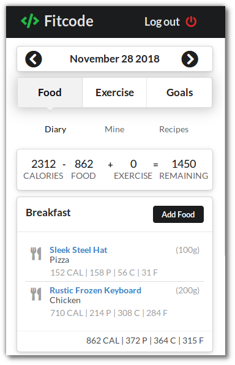

# fitcode

The project I did in order to obtain my __BSc in Computer Science__.

 > A **Single Page Application** that lets you track your diet in an easy and comfortable way and it's intended to be used in a mobile phone.

 >The main goal of it was improving my knowledge in **Javascript** using a **Full Stack Development** approach.

**Tech stack**:

- [Create React App](https://github.com/facebookincubator/create-react-app)
- [Semantic UI React](https://react.semantic-ui.com/)
- [Redux](https://redux.js.org/introduction)
- [Axios](https://github.com/axios/axios)
- [Node](https://nodejs.org/en/)
- [Express](https://expressjs.com/)
- [Passport](http://www.passportjs.org/)
- [MongoDB](https://www.mongodb.com/)
- [Mongoose](https://mongoosejs.com/)
---

  
   
  <a href="https://fitcode-0xkush.herokuapp.com/">  You can find the demo here </a>

